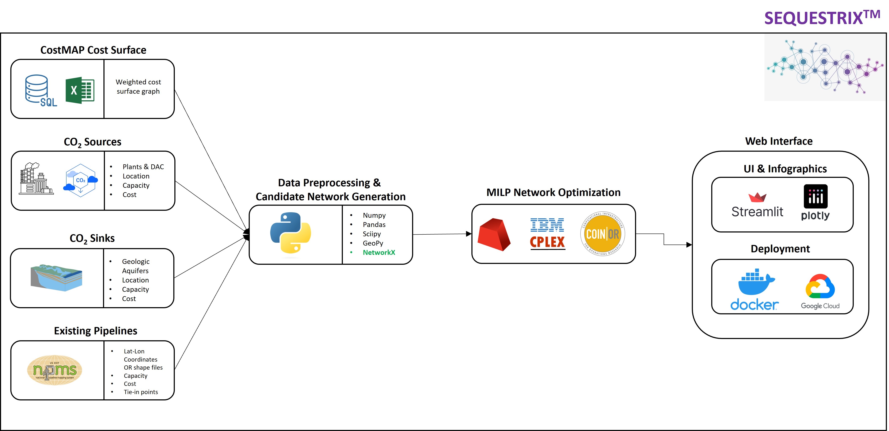

# SEQUESTRIX - CO2-TRANSPORT-NETWORK-OPTIMIZATION

Sequestrix is a CO2 transport network optimization tool designed to enable design, optimization and project economics of complex sequstration projects. 

The design enables embedding of existing CO2 pipelines in generating candidate network and allows for varying scenarios of pipeline capacities, flow direction, and tie-in points.

Sequestrix was built using mostly open-source tools and the framework is as described in the illustration below

There are several underlying complex graph algorithms powering
