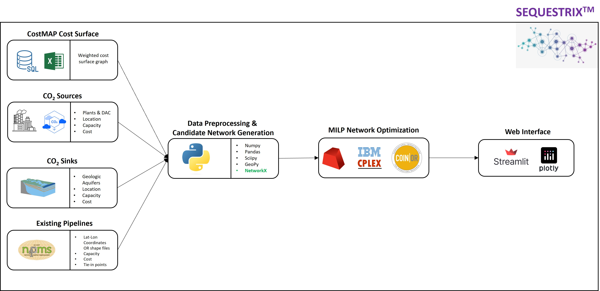
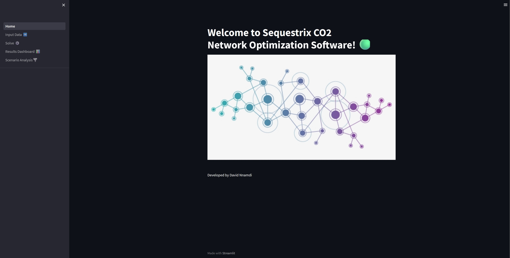
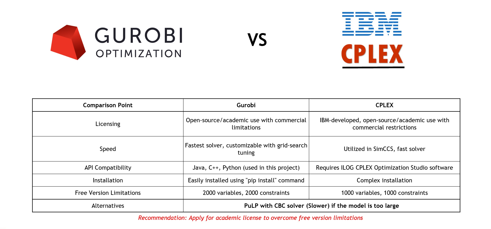

# SEQUESTRIX - CO2-TRANSPORT-NETWORK-OPTIMIZATION

Sequestrix is a CO2 transport network optimization tool designed to enable design, optimization and project economics of complex sequstration projects.

Building on some of the foundations laid by SimCCS, the design enables embedding of existing CO2 pipelines in generating candidate network and allows for varying scenarios of pipeline capacities, flow direction, and tie-in points.

Sequestrix was built using mostly open-source tools and the framework is as described in the illustration below:



The typical sequestrix workflow is as follows:

1. Prepare CO2 source and sink data (geolocation, capture/storage capacities & cost) as a `.csv` input file and import into Sequestrix
2. If there are existing pipelines to be considered for analysis and finescale geolocation is not available, one can source the pipeline geolocation from the National Pipeline Mapping System (NPMS). This must also be saved as a `.csv` file and imported into Sequestrix
3. Generate cost surface map using CostMAP open source tool. The cost surface is a rasterized graph representation of the relative cost of constructing pipeline from point A to B. Cost surfaces are typically large files (>100MB) and typically subsets for regions of interest should be utilized. The cost surface is not directly imported into Sequestrix and steps to ensure it is present prior to running tool is outlined in the installation guide.
4. Using data from 1, 2 & 3, generate the candidate network (routing related) using complex graph and GIS based algorithms. This candidate network is refined to remove redudant edges before next step.
5. Represent candidate network as a Mixed-Integer-Linear-Programming (MILP) Network with graph edges representing flow capacity, costs and constraints. Solve MILP with State-of-the-art optimization solvers. Solver selection details is discussed further in subsequent section.
6. The solution from 5 is aggregated, and displayed using GIS plots and analytics dashboards displayed on the web interface powered by streamlit.

# Installation guide

The following steps outline how to install and try out Sequestrix - Note that these steps assume you have no access to CostMAP and as such a subset cost surface graph has been provide

Step 1: Open terminal, Clone repo

```
git clone https://github.com/davidpcg01/CO2-TRANSPORT-NETWORK-OPTIMIZATION-PROJECT.git
```

Step 2: Download the cost surface graph with link below and add to your cloned repo folder

[https://www.mediafire.com/file/a4q2kzgajgui9q9/construction-costs-subset.csv/file]()

Step 3: Install all necessary packages and dependencies using pip

```
pip install -r requirements_pip.txt
```

Step 4: Run the following command to get Sequestrix App running. The App will either open up on your web brower or you will get a Local URL which you can copy and paste on any web browser to open

```
streamlit run Sequestrix/Home.py
```

The user Interface opened should look like this:


At this point you are free to run your analysis. A quick user guide is made available in this repository. 

A conference paper publication was written to demonstrate using Sequestrix for more complex case studies. If you want to read more and test out the scenarios yourself, you may access the paper here. The files needed to run experiments are located in `/input_data/SPETEST`

# SOLVER SELECTION

For Sequestrix to work, one must have either the Gurobi or IBM CPLEX solver engines installed. There are free and professional versions of these solvers available. My general recommendation is to install gurobi free version (the python API is installed when you run step 3 in section above) and if you need to carry out more complex analysis and you are in academia, apply for an academic license. The table below sumarizes the difference between both Gurobi and CPLEX and why the underlying framework for Sequestrix was Built using Gurobi

